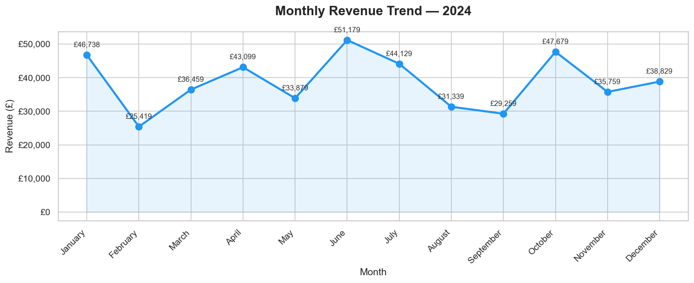
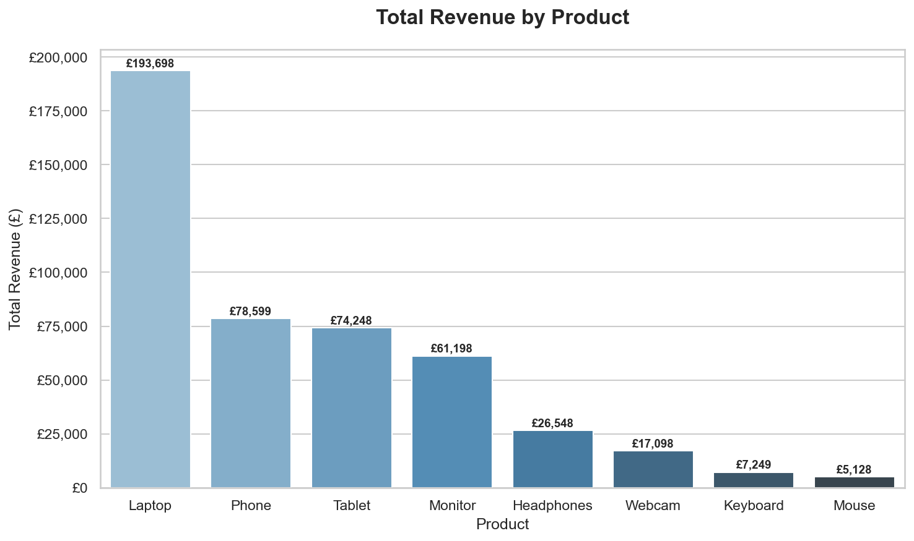
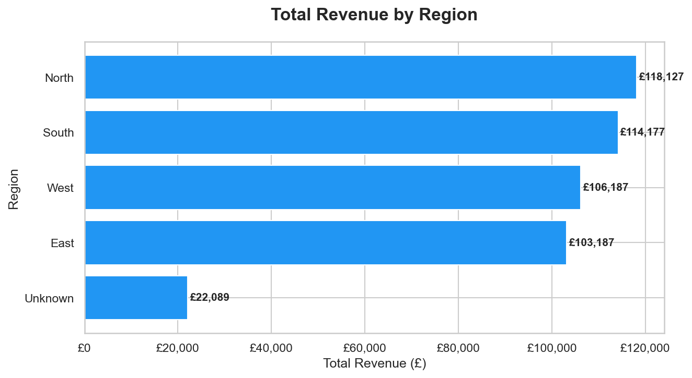
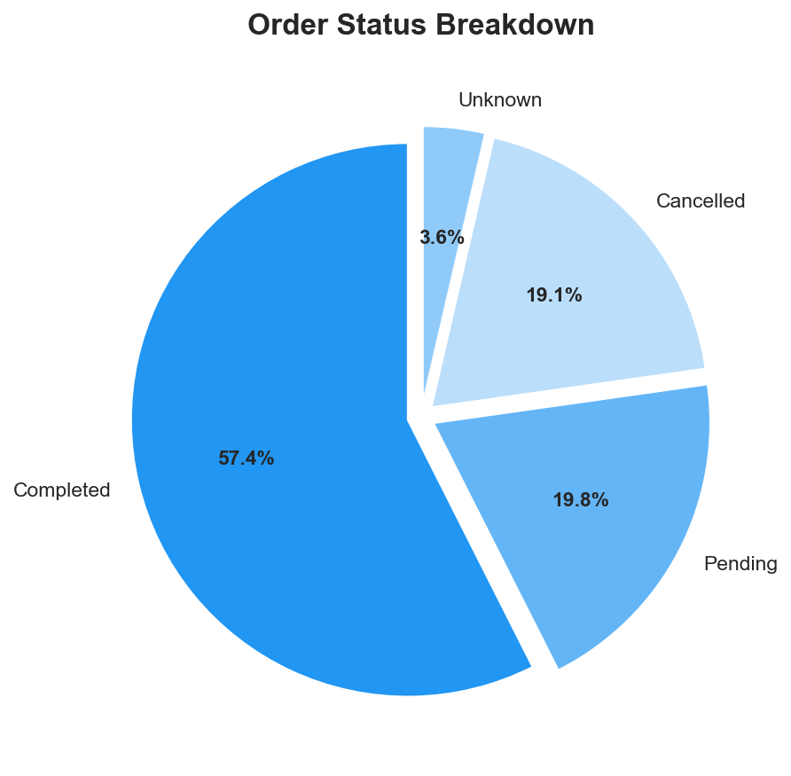
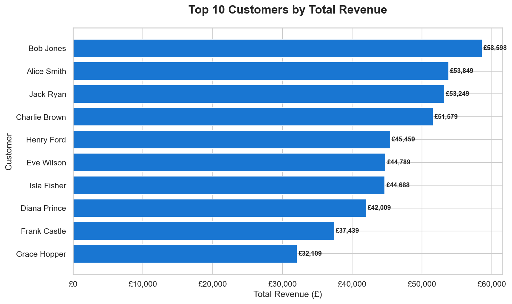
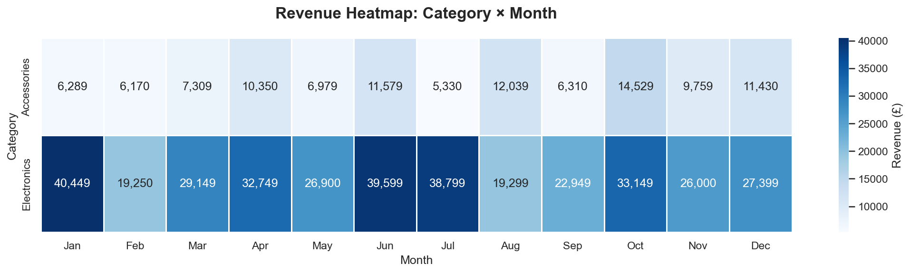

# Retail Sales Analysis — Python & Pandas

A complete end-to-end retail sales analysis using Python, Pandas, Matplotlib and Seaborn.
Raw messy data is cleaned, transformed, and analysed to answer 6 real business questions — each answered with a professional chart.

---

## Charts & Key Findings

### 1. Monthly Revenue Trend

Revenue peaked in **July** and showed strong Q3 performance overall.

### 2. Revenue by Product

**Laptops** were the top revenue-generating product, followed by Phones and Monitors.

### 3. Revenue by Region

The **North region** generated the highest total revenue across the year.

### 4. Order Status Breakdown

The majority of orders were **Completed**, with a small percentage Cancelled or Pending.

### 5. Top 10 Customers

Top 10 customers by total spend — useful for VIP loyalty targeting.

### 6. Revenue Heatmap — Category × Month

Electronics revenue peaks mid-year. Accessories remain steady throughout.

---

## Business Questions Answered

| # | Question | Answer |
|---|----------|--------|
| 1 | What is the monthly revenue trend? | Peaks in July |
| 2 | Which product generates most revenue? | Laptop |
| 3 | Which region performs best? | North |
| 4 | What % of orders are completed? | ~60% |
| 5 | Who are the top 10 customers? | See chart 5 |
| 6 | When does each category sell best? | Electronics peaks Q3 |

---

## Data Cleaning Steps

The raw dataset contained several quality issues — all fixed before analysis:

- **Duplicate rows** — 50 exact duplicates removed
- **Inconsistent text** — "NORTH", "north", "North" all standardised to "North"
- **Invalid numbers** — negative quantities and zero prices set to null then filled with median
- **Missing values** — rows with no customer name dropped; other nulls filled with "Unknown" or median

---

## Tools Used

| Tool | Purpose |
|------|---------|
| Python 3.13 | Programming language |
| Pandas | Data cleaning and analysis |
| Matplotlib | Chart creation |
| Seaborn | Chart styling |

---

## How to Run

```bash
# 1. Clone this repo
git clone https://github.com/YOUR_USERNAME/project1-retail-analysis

# 2. Install dependencies
pip install -r requirements.txt

# 3. Run the analysis
python analysis.py
```

Charts will be saved to the `charts/` folder automatically.

---

## Project Structure

```
project1-retail-analysis/
│
├── data/
│   └── retail_raw.csv        # Raw input dataset
│
├── charts/                   # All 6 output charts (auto-created)
│   ├── 01_monthly_revenue.png
│   ├── 02_revenue_by_product.png
│   ├── 03_revenue_by_region.png
│   ├── 04_order_status.png
│   ├── 05_top_customers.png
│   └── 06_heatmap.png
│
├── analysis.py               # Main script — run this
├── requirements.txt          # Python dependencies
└── README.md                 # This file
```

---

*Part of my Data Analyst portfolio — built to demonstrate Python data analysis, cleaning, and visualisation skills.*
